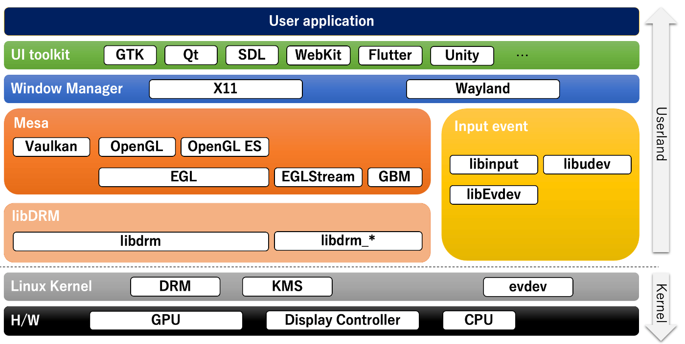
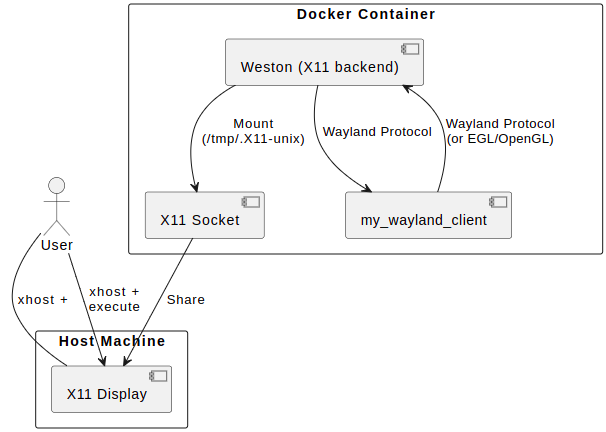
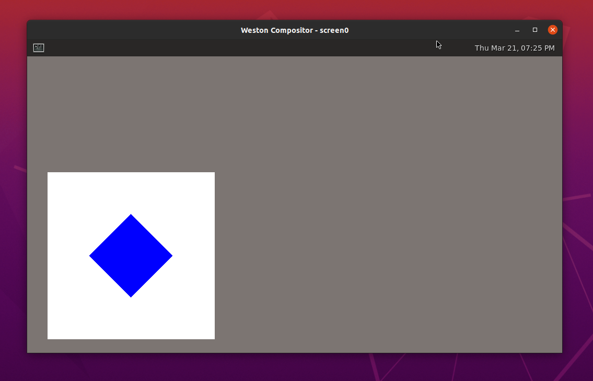

# my-wayland-client

## Introduction

`my-wayland-client` is a project demonstrating how to run GUI applications on Wayland within a Docker container. This project leverages Weston as the Wayland compositor backend and showcases the operation of a custom Wayland application named `my_wayland_client`.

## Features

- Running GUI applications on Wayland using Docker
- Utilizing Weston as the Wayland compositor
- Simple and easy-to-use setup

## Prerequisites

Before you begin, ensure you have the following installed on your host machine:

- Docker
- X server

## Getting Started

To get started with `my-wayland-client`, clone the repository and follow the steps below.

```bash
git clone https://github.com/ottomossei/my-wayland-client.git
cd my-wayland-client
bash docker_run.sh
```

## Architecture
First, a rough overall view of Linux graphics is shown below.  
Reference : https://zenn.dev/hidenori3/articles/c2be2bd50fc8dd


The following diagram provides an overview of the architecture in this project:


## Results
Here's what you can expect as an output when you run the application. Note that the actual output may vary depending on the development stage.


